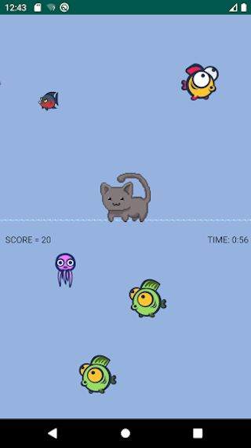

# Submeowrine

Sub-'meow'-rine is a 2D shooting game published on Google Play. During the gameplay, you will control a small kitten to defeat all the enemies in the deep ocean. Download now from the link below and compete with your friends!

[![Google Play badge][1]][2]

[1]:  ./app/src/main/res/raw/google-play-badge.png
[2]:  https://play.google.com/store/apps/details?id=com.catswarzone "Redirect to store page"

This application is handcrafted on Android Studio with Java. The program implements several GOF design patterns to accomplish more efficient performance and code readability. The used design patterns are factory, strategy, observer, builder, singleton, template method, and facade.